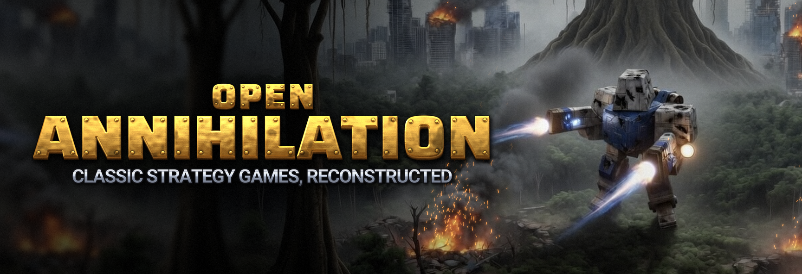
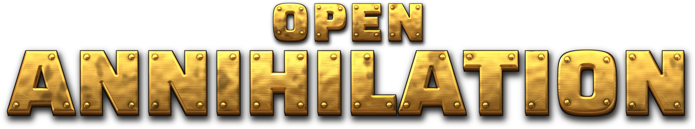
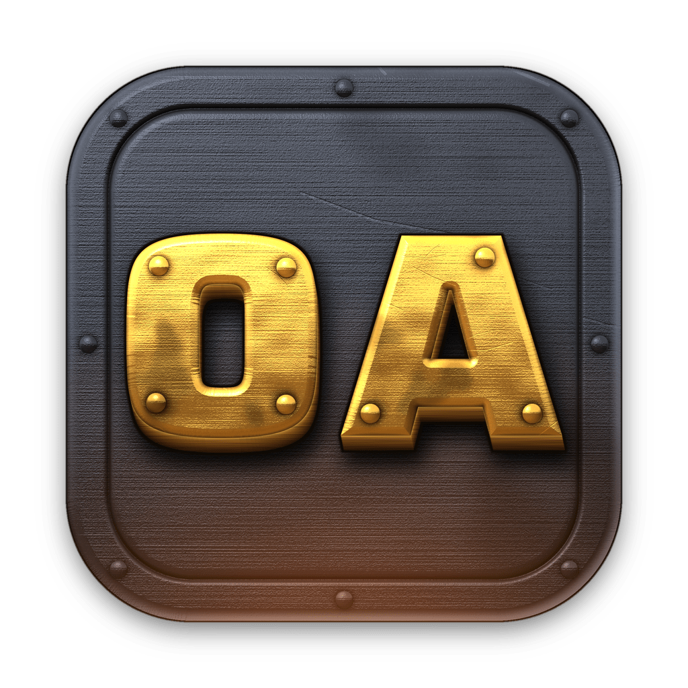
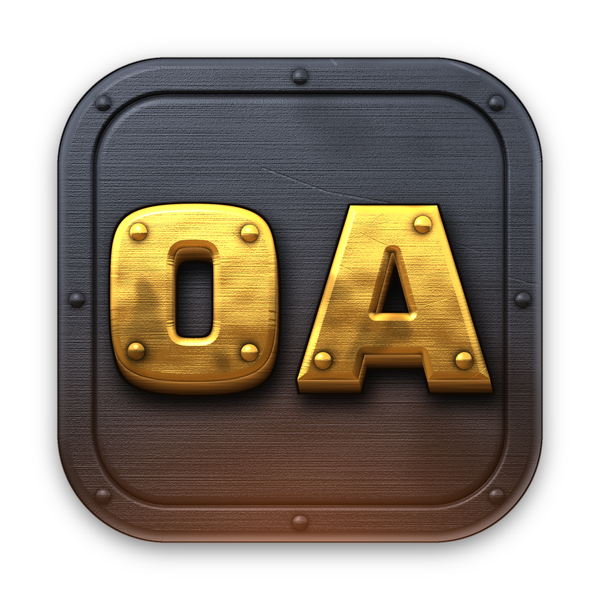

# Open Annihilation branding

The official name, logos and icons of [Open Annihilation](https://github.com/open-annihilation/open-annihilation).

> **Copyright © 2026 Steve Gray. All rights reserved.**
> These images are not covered by the GNU GPL or by any other licence that
> applies to the Open Annihilation software. No rights to use, copy, modify or
> distribute them are granted without prior written permission. See
> [LICENSE](LICENSE).

| Asset | Size | Preview |
|---|---|---|
| [`logos/open-annihilation-header.png`](logos/open-annihilation-header.png) | 1728 × 592 |  |
| [`logos/open-annihilation-logo.png`](logos/open-annihilation-logo.png) | 1837 × 342 |  |
| [`logos/open-annihilation-icon.png`](logos/open-annihilation-icon.png) | 1024 × 1024 |  |
| [`logos/open-annihilation-icon-compact.png`](logos/open-annihilation-icon-compact.png) | 1024 × 1024 |  |
| [`logos/open-annihilation-icon-600.png`](logos/open-annihilation-icon-600.png) | 600 × 600 |  |

Open Annihilation is an independent project and is not affiliated with or
endorsed by the owners of Total Annihilation. Total Annihilation is a
trademark of its respective owners.
